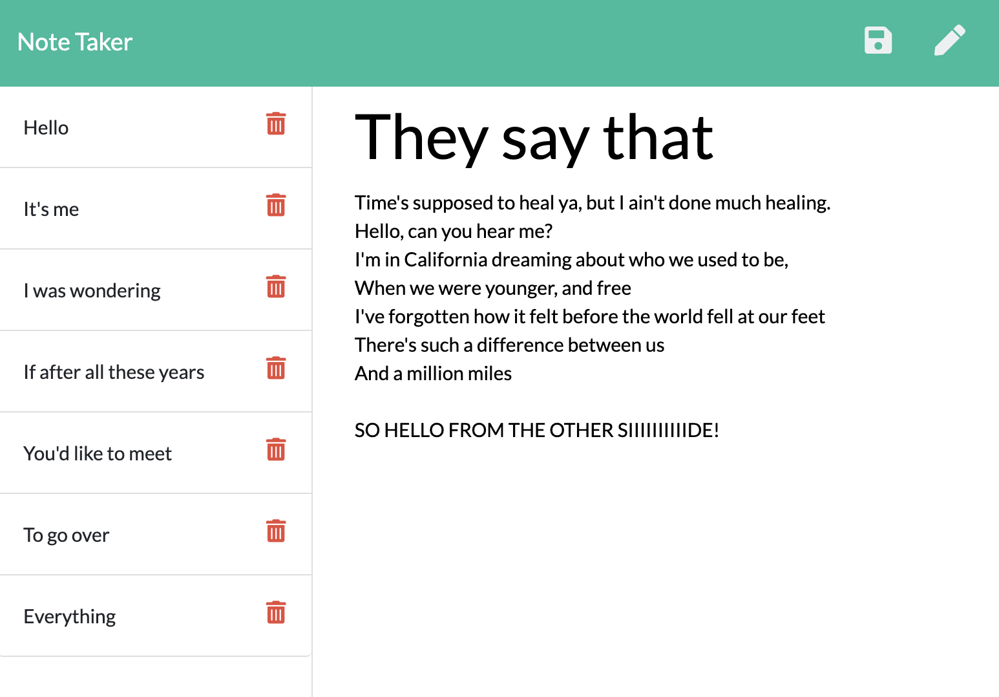

# note-taker

## Description

This is my ninth homework assignment for the University of Denver Web Development Boot Camp!  

For this project, I was to build an app that allows a user to input and save notes.  

This project is the first complete application I've built that utilizes Express.js to enable its back end functionality. If I'm being honest, it was pretty difficult to complete as all the Express syntax and logic is still very fresh. However, I learned a ton by completing the project, and definitely have a more thorough understanding of Express now thanks to building this app.

## Deployment

The code (and associated assets) are hosted right here in this GitHub repository, and it's all live on the web thanks to Heroku. If you would like to check it out, you can view the site at the link below:

<a href="https://hidden-reef-30271.herokuapp.com/" target="_blank"><b>note-taker Live App</b></a>
  

## Credits

This project was made using HTML, CSS, Javascript, Node.js, and Express.js.
